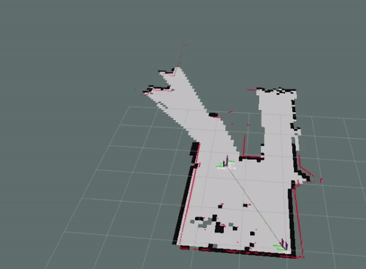

# Differential Drive Robot

I built a differential drive robot to learn the fundamentals of robotics and to have a physical platform to implement robotics algorithms. I roughly followed a guide offered by the book "Practical Robotics in C++" by Lloyd Brombach, using the same hardware as he suggested and parts of the code at https://github.com/lbrombach/practical_robot.git. I chose to use older versions of ROS and Ubuntu that were used in Brombach's approach to avoid spending time resolving compatibility/dependency issues.

Differences from the approach taken in the book include:
- I used the ROS package robot-pose-ekf to estimate robot pose using both IMU and wheel odometry sensor data, while Brombach uses a simplified method of incorporating IMU data
- I refactored most of the code in OOP style (work in progress) while Brombach's version avoids OOP

The final robot is capable of mapping its environment and intelligently navigating that environment.

## Robot Specifications

<div style="display:flex;">
  
  
</div>

<br>
Simple differential drive robot with the following capabilities/properties:

- Raspberry Pi 3B running Ubuntu 16.04.7 Xenial Xerus and ROS-kinetic-1.12.17, with ROS nodes written in C++
- Differential drive with proportional controller
- L298N Dual H-bridge motor driver
- Roomba wheel modules with built-in Hall-effect encoders
- Adafruit 9-DOF Absolute Orientation IMU Fusion Breakout - BNO055
- Odometry using robot-pose-ekf package used to fuse sensor data from wheel encoders and IMU to estimate robot-pose
- RPLIDAR A1 360 degree 2D lidar scanner used for creating costmaps with gmapping package and performing object detection
- Given initial pose and goal, A* path planning algorithm used to plot a path avoiding obstacles for autonomous navigation
- Logitech C270 USB web camera for remote navigation
- Non-autonomous driving with Logitech F710 gamepad control (useful for mapping)

## Installation

This just covers the installation steps required on the robot's Raspberry Pi 3B. The developer will also need to install ROS on their development machine, primarily for running Rviz.

### ROS Kinetic Install

In software centre set options to allow downloading from restricted, universe, and multiverse.

Follow ROS installation steps at:

https://wiki.ros.org/kinetic/Installation/Ubuntu

Opt for the Desktop Full-Install option:
```
sudo apt-get install ros-kinetic-desktop-full
```

Initialize rosdep and set some environment variables:
```
sudo rosdep init
rosdep update
echo "source /opt/ros/kinetic/setup.bash" >> ~/.bashrc
source ~/.bashrc
sudo apt install python-rosinstall python-rosinstall-generator python-wstool build-essential
```
### Catkin Workspace
Setup the folder directory where the ROS project will be organized:
```
cd ~
mkdir -p catkin_ws/src
cd catkin_ws
catkin make
```
To check that the ROS master node runs without errors:
```
roscore
```
This must be always be running to run ROS nodes. It is automatically run with the execution of any launch file.

### Clone the Project

Navigate to the src folder of the project and clone the project code:
```
cd ~/catkin_ws/src
git clone https://github.com/Imaccer/practical_robot.git
cd catkin_ws
catkin make
```


### 3rd Party Sensor Packages
This project also uses 3rd party ROS packages for two of the sensors used: the Adafruit BNO055 IMU and the A1 RPLIDAR Scanner. As an optional extra, the ROS usb_cam_node is also used for the Logitech C270 USB camera.

In the src directory:
```
cd ~/catkin_ws/src
git clone https://github.com/lbrombach/bn0055_fusion_imu.git
cd ~/catkin_ws
catkin make
```
The IMU must be calibrated using the setup node:
```
rosrun bn0055_fusion_imu bn0055_setup_util_node
```
Ensure the frame is calibrated according to the orientation of the IMU and that it is returning a correct measurement of gravitational acceleration. Save the configuration (as guided by the command line menu).

The Lidar scanner ROS package can be installed as follows:
```
cd ~/catkin_ws/src
git clone https://github.com/Slamtec/rplidar_ros.git
cd ~/catkin_ws
catkin make
```
It was found that running the lidar node in a separate terminal window was more reliable than running as part of a launch file:
```
rosrun rplidar_ros rplidarNode
```

### PIGPIO

The pigpio library is written in C and allows control of the General Purpose Input Outputs (GPIO) of the Raspberry Pi, enabling interface with hardware. 

Installation instructions can be found here:

https://abyz.me.uk/rpi/pigpio/download.html

Once installed, the libpigpiod_if2.so file must be located appropriately, and referenced in the CMakeLists.txt file, and the pigpio daemon must be running:
```
sudo pigpiod
```
The daemon must be running for any ROS nodes that interact with hardware through the GPIO pins. 

## Robot Operation

### Remote Driving Mode 
Before being able to map its environment, the robot must be controllable remotely. This can be achieved using the rqt-steering GUI. However, it is a lot easier to use a gamepad controller. I used a Logitech F710 gamepad along with the ROS joy (https://wiki.ros.org/joy) and joy_teleop (https://wiki.ros.org/joy_teleop) packages.

The button mappings are configured in a .yaml file in practical_nav/config.

For gamepad controlled driving with no sensors:
```
roslaunch joy_launch_diffDriveRobot.launch
```

### Mapping Mode 

The next step is to be able to map the robot's environment using the Lidar scanner.

Software to save the map file generated using gmapping and the Lidar scanner can be installed with:

```
sudo apt-get install ros-kinetic-map-server
```
To map an area, it is necessary to drive the robot slowly around the area of interest, taking care to minimize wheel slippage. Two separate launch files are used to perform mapping:
```
roslaunch practical_nav joy_mapping.launch
```
And in another terminal:
```
roslaunch practical_nav gmapping_only.launch
```
Finally, the Lidar node can be run in a separate terminal window (it was found to operate more reliably when ran outside a launch file):
```
rosrun rplidar rplidarNode
```
An optional extra is to run the USB camera to be able to remotely drive the robot.

Rviz is used to visualize the mapping process on the development machine. The devlopment machine must be connected via ssh to the robot and also connected to the instance of roscore running. This is easily achieved via setting the environment variable ROS_MASTER_URI on the devlopment machine to the IP address associated with ROS_MASTER_URI on the robot (visible when you run roscore). Rviz config files can be used to save rviz configurations for different visualization scenarios. In this case we can use the joy_mapping.rviz file:
```
rviz rviz -d joy_mapping.rviz
```
As the robot moves around, the map will be filled in:



<br>

 Once the entire area has been successfully mapped, the map can be saved as follows:
```
cd ~/catkin_ws/src/practical_robot/practical_nav/maps
rosrun map_server map_saver -f upperFloorMap
```
The map_saver node will generate two files, a .PGM image file and .yaml file containing map metadata.

#### Loading Previously Saved Map
To load a saved map run:
```
rosrun map_server map_server upperFloorMap.yaml
```
Also, check the file basic_full.launch for an example of how to load an existing costmap in a launch file.

### Autonomous Drive Mode

The final robot is able to intelligently navigate and costmap generated using its Lidar scanner and the gmapping package, using a path planning algorithm, and sensor data from wheel encoders and an IMU to accurately locate itself within the map.

For full operation of the robot, run the following commands:
```
roslaunch practical_nav basic_full.launch
```
For simplicity, locate the robot at the origin of your map (bottom left corner), initialize the pose to the starting position.

In separate terminals, run each of the following commands:
```
rosrun rplidar_ros rplidarNode
rosrun usb_cam usb_cam_node
rosrun practical_localization rviz_click_to_2d
```
The rviz_click_to_2d node allows the user to specify a target goal robot pose in the Rviz visualization with the 2d Nav Goal feature.

The basic_full.launch file runs all the other nodes required, loads the costmap generated for environment, and sets the static transforms for different reference frames of the robot components (e.g., the Lidar scanner and IMU).


## Troubleshooting / Debugging
The following gives a list of troubleshooting techniques used:

- ```rosrun rqt_tf_tree rqt_tf_tree``` : this command is useful for viewing the connections between different reference frames, and to spot when there is a break in the tree
-  ```rostopic echo topic_name```: check the output from a topic and which ROS nodes are publishing/subscribing to that topic
- ```rostopic rqt_graph rqt_graph``` : view connectivity between publishers and subscribers to topics.
- ```rosrun rviz rviz``` - real-time visualization of sensor data, tf-frames, robot's environment, the path calculated for autonomous mode etc.
- ```rosbag record -a``` : record and playback all ROS message traffic as if the robot was operating in real-time. Playback with ```rosbag play nameOfFile.bag```. Can also specify topics to record.
- ```gdb ~/catkin_ws/devel/package_name/rosNode```: to troubleshoot a particular node you can run the binary in GDB 


## License

Specify the license under which your ROS project is distributed. Include any relevant copyright notices and license terms. If you're using third-party libraries or dependencies, make sure to mention their licenses as well.
