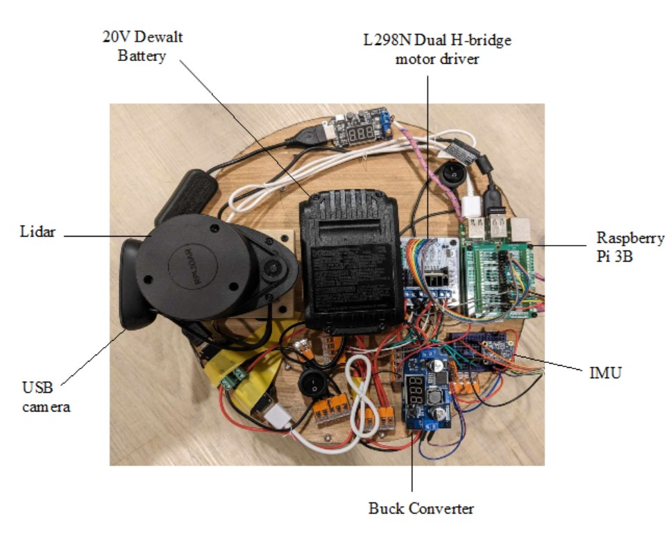
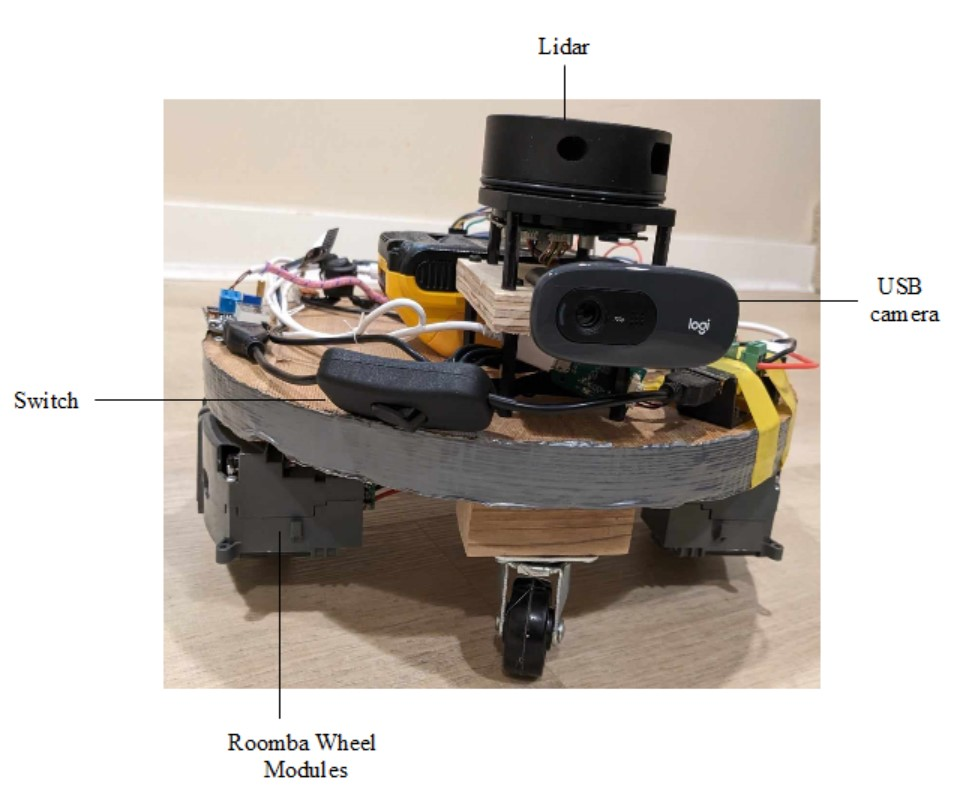

# Differential Drive Robot

. Highlight what changed from practical robot example... use of robot-pose-ekf to estimate robot pose using both IMU and wheel odometry, rewrote code in OOP style. 

## Table of Contents

- [Introduction](#introduction)
- [Installation](#installation)
- [Usage](#usage)
- [Mapping](#mapping)
- [Examples](#examples)
- [Contributing](#contributing)
- [License](#license)

## Introduction

<!-- .gif) -->


Provide a detailed explanation of what your ROS project does, its purpose, and any relevant background information. Include the motivation behind the project and its intended audience.
Built a simple differential drive robot with the following capabilities:

- Raspberry Pi 3B running Lubuntu and ROS-kinetic, with ROS nodes in C++
- L298N Dual H-bridge motor driver
- Differential drive with proportional controller
- Given initial pose and goal, uses A* path planning algorithm to plot a path avoiding obstacles for autonomous navigation
- RPLIDAR A1 360 degree 2D lidar scanner used for creating costmaps with gmapping package
- Odometry using robot-pose-ekf package with Roomba built-in hall-effect encoders for wheel odometry and Adafruit 9-DOF Absolute Orientation IMU Fusion Breakout - BNO055
- USB camera for remote navigation
- Non-autonomous driving with Logitech F710 gamepad control, useful for mapping

<!--  -->





## Installation

Describe the steps needed to install your ROS project, including any dependencies that need to be installed beforehand. Provide clear instructions for both source installation and binary installation (if applicable). Include commands and configuration examples.

### PIGPIO

The pigpio library is written in C and allows control of the General Purpose Input Outputs (GPIO) of the Raspberry Pi, enabling interface with hardware. 

Installation instructions can be found here:

https://abyz.me.uk/rpi/pigpio/download.html

Once installed, the libpigpiod_if2.so file must be located appropriately, and referenced in the CMakeLists.txt file, and the pigpio daemon must be running:
```
sudo pigpiod
```

### Catkin workspace

```

```

### 3rd Party Sensor Packages
In the practical_robot directory:
```
git clone https://github.com/lbrombach/bn0055_fusion_imu.git

git clone https://github.com/Slamtec/rplidar_ros.git

git clone ... joy stick repo
```

## Mapping
Software to save the map file generated using gmapping and the Lidar scanner can be installed with:

```
sudo apt-get install ros-kinetic-map-server
```
To map an area, it is necessary to drive the robot slowly around the area of interest, taking care to minimize wheel slippage.
```
roslaunch practical_nav joy_mapping.launch
```
In another terminal, run:
```
roslaunch practical_nav gmapping_only.launch
```

```
cd /practical_nav/maps

```

## Usage

Explain how to use your ROS project once it's installed. Provide examples of typical usage scenarios, including command-line usage and configuration settings. Describe the main functionalities and how users can interact with them.

Explain basic_full.launch, loads costmap generated for environment, set initial pose, set static transforms for different reference frames


## Examples

Provide code examples or usage scenarios to demonstrate your ROS project's capabilities. This section can include example launch files, code snippets, or screenshots to illustrate different features.

## Contributing

Outline guidelines for contributing to your ROS project. Include information on how to report bugs, submit feature requests, or contribute code. Provide instructions for setting up a development environment and guidelines for code formatting, testing, and submitting pull requests.

## License

Specify the license under which your ROS project is distributed. Include any relevant copyright notices and license terms. If you're using third-party libraries or dependencies, make sure to mention their licenses as well.
